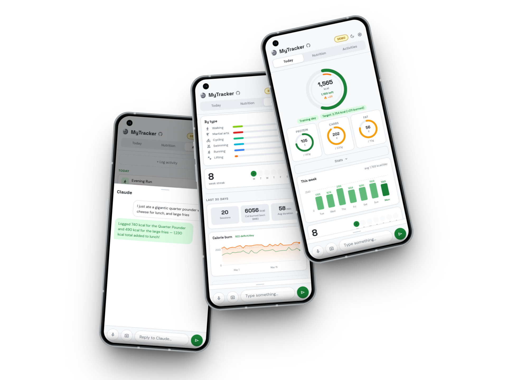

# <picture><source media="(prefers-color-scheme: dark)" srcset="brand/svg/logo-mono-light.svg"><source media="(prefers-color-scheme: light)" srcset="brand/svg/logo-mono-dark.svg"></picture> MyTracker



---

Self-hosted health and fitness tracker. Vanilla HTML/CSS/JS, Supabase backend, Claude AI assistant for natural-language logging. No framework, no build step, no subscriptions.

Try the demo at [gonespral.github.io/my-tracker](https://gonespral.github.io/my-tracker/?demo=1).

## Features

- **AI Logging:** Chat with Claude to log food, workouts, and weight in plain English. Attach photos and Claude uses vision to identify meals. Frequently logged items are suggested as presets automatically.
- **Nutrition:** Daily food tracking with calorie and macro targets (rest vs. training day). Meal presets for quick re-logging.
- **Workouts:** Manual logging with intensity, duration, distance, and heart rate. Activity presets. Push to Strava.
- **Integrations:** Auto-sync from Strava and Google Health with duplicate detection.
- **Voice input:** Dictate food or workout entries via the Web Speech API.
- **PWA:** Installable, mobile-first, dark mode, smooth animations.
- **Privacy-first:** Your Supabase instance, your data. Row-Level Security on all tables. API keys live only in `localStorage`.

> [!note]
> This project is heavily vibecoded. It exists because every fitness tracker I tried either lacked the one feature I actually needed, buried it behind a subscription, or couldn't integrate with Strava and Google Fit without janky middleware. So I built my own. Expect rough edges and code that works because it works.

## Architecture

Vanilla JS SPA. Static `index.html` shell; all panels rendered dynamically by JS modules via `innerHTML`. Events delegated from a single top-level listener in `app.js` via `data-action` attributes. No bundler.

| File | Role |
|:---|:---|
| `js/app.js` | Entry point — auth, tabs, event delegation |
| `js/state.js` | Single mutable state object shared across modules |
| `js/db.js` | Supabase client + all DB operations |
| `js/ai.js` | Claude API, chat panel, tool execution |
| `js/strava.js` | Strava OAuth + sync + push |
| `js/google-health.js` | Google Health OAuth + sync |
| `js/tabs/` | Per-tab renderers (today, nutrition, workouts, settings) |

**Auth:** GitHub or Google OAuth via Supabase. Sign-in overlay shown when no session exists.

**AI chat:** Claude API called directly from the browser using an Anthropic key stored in `localStorage`. Supports tool use (log/edit/delete food, workouts, weight; manage presets; update targets) and image attachments (vision).

## Database

Run migrations in `supabase/migrations/` in order against a fresh Supabase project.

| Migration | What it does |
|:---|:---|
| `00001_initial_schema.sql` | Tables (`food_entries`, `workout_entries`, `weight_entries`, `meal_presets`, `workout_presets`, `user_settings`), RLS policies, indexes |

## Setup

### Local Development

```bash
git clone https://github.com/gonespral/health-tracker.git
cd health-tracker
npm run dev   # serves on http://localhost:3000
```

### Supabase

1. Create a new Supabase project.
2. Run each file in `supabase/migrations/` in order via the SQL Editor.
3. Copy `js/env.example.js` → `js/env.js` and fill in your Supabase URL, anon key, and any OAuth client IDs.
4. Enable **GitHub** and/or **Google** under Authentication → Providers.
5. Add your local and production URLs as redirect URIs.

### Claude AI

Get an API key from the [Anthropic Console](https://console.anthropic.com/), then paste it in the app's Settings sheet. Stored in `localStorage` only.

### Strava & Google Health

Enter client credentials in Settings within the app.

- **Strava:** Register at [strava.com/settings/api](https://www.strava.com/settings/api).
- **Google Health:** Create a web client ID in the [Google API Console](https://console.developers.google.com/) and enable the Fitness API.

#### Calorie spoofing (Strava)

Strava doesn't allow setting calories on manually created activities via the API. When enabled, the app derives a synthetic heart rate from your logged calories, duration, weight, age, and sex (Keytel et al. 2005), uploads the activity as a TCX file, and lets Strava compute the calories from the heart rate data. Requires weight, age, and sex set in Settings → Profile.

## Deployment

Pushes to `main` deploy to GitHub Pages via `.github/workflows/deploy.yml`. Set these repository secrets under Settings → Secrets → Actions:

- `SUPABASE_URL`
- `SUPABASE_ANON_KEY`
- `STRAVA_CLIENT_ID`
- `GOOGLE_HEALTH_CLIENT_ID`

The workflow injects them into a generated `js/env.js` before publishing.

## License

[MIT](LICENSE)
